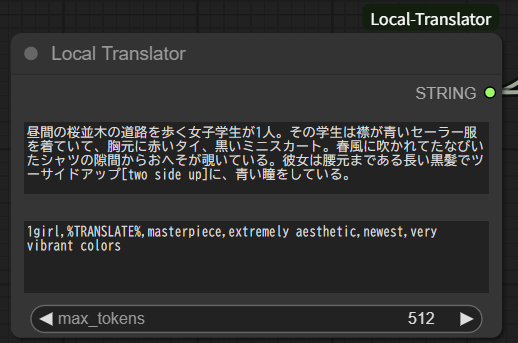
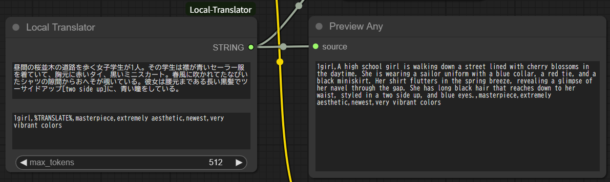

# ComfyUI Local Translator
ローカルSLM(Microsoft Phi-4)を用いたテキスト翻訳ノードです。 
This is a text translation node for ComfyUI using a local SLM (Microsoft Phi-4).

!!! ComfyUIの一定の知識を前提とし、今のところ初心者向けの案内はしていません。 !!! 
!!! CURRENTLY INTENDED FOR DEVELOPERS. NOT RECOMMENDED FOR BEGINNERS. !!!

## 特徴 / Features
* ローカルSLMを用いた翻訳を行います。 
  This node performs translation using a local SLM.
  * Google Translatorなどを使う翻訳ノードと比べAPI回数制限などを受けません。 
    Unlike nodes using Google Translator, there are no API call limits.
  * 検閲を受けません。(笑) 
    No censorship is applied.
* ローカルSLMもComfyUIのモデルマネジメント下に入ります。 
  The local SLM is also managed by ComfyUI's model management, including VRAM control.
* トリガーワード指定が可能になっています。 
  You can specify trigger keywords.

## インストール方法 / Installation
通常のcustom nodesと同様です。割愛します。 
Installation is the same as other custom nodes for ComfyUI. Details are omitted.

初回実行時にHugging Faceよりモデルをダウンロードします。 
The model will be downloaded from Hugging Face the first time you run this extension.

## 使い方 / Usage
#### 基本的な使い方 / Basic Usage
上段に翻訳する文字列を、下段の文字列は原則としてそのまま出力されます。 
Enter the string to be translated in the upper field. The lower field is generally output as is. 
下段を指定する場合、 **%TRANSLATE%** を含めて指定する必要があり、このキーワード部分に上段で指定した翻訳した後の文字列が埋め込まれて出力されます。 
If you use the lower field, you must include **%TRANSLATE%** at once. The translated string from the upper field will be inserted at this keyword.

#### 特殊ルール / Special rules
翻訳する文章には次の特殊ルールが適用されます。 
The following special rules apply to sentences to be translated:

1. _文_[_キーワード_] / _SENTENCE_[_KEYWORD_]

    前の文を角括弧内に指定したキーワードで表現するように指示します。 
    Instructs the translation to express the previous SENTENCE using the KEYWORD in brackets.

    例 / Example:
    * Input: 大きなツインテール[pigtails hair]が彼女の特徴だ。 
      Translated: Her big pigtails hair are her defining feature.

2. [_文_|_キーワード_] / [_SENTENCE_|_KEYWORD_]

    角括弧内の縦棒前の文を縦棒の後ろのキーワードで表現するように指示します。 
    Instructs the translation to express the SENTENCE before the vertical bar in brackets using the KEYWORD after the vertical bar.

    例 / Example:
    * Input: 彼は約20年にわたり[アイドルマスター|"THE IDOLM@STER"]に夢中だ。 
      Translated: He has been crazy about "THE IDOLM@STER" for about 20 years.

特定のトリガーキーワードを指定する時に便利です。 
This is useful when you want to specify particular trigger keywords.
